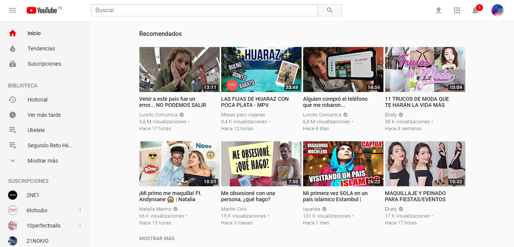

# UX
-  Diferentes tamaños de videos y calidad del mismo.
- Las opciones de dejar comentarios y poder indicar que video te gusta o no.
- Los recomendados que te dan en base a los videos que sueles ver.
- Recibir notificaciones de los canales que mas solemos ver.
- La opción de ponerle ponerle subtitulos a los videos que vemos.
- Opciones de compartir con redes sociales.
- Guardar videos para verlos mas tarde en caso no tengamos tiempo.
- Vista previa de los videos al posicionar el mouse.
- Opciones de subir contenido de una forma sencilla.

# UI
- Colores de la pagina rojo y blanco.
- Tipografías de toda la pagina.
- Color del logo de la página.
- Tamaño de los diferentes iconos.
- Forma y color del menú hamburguesa.
- Tamaño de miniaturas de videos.
